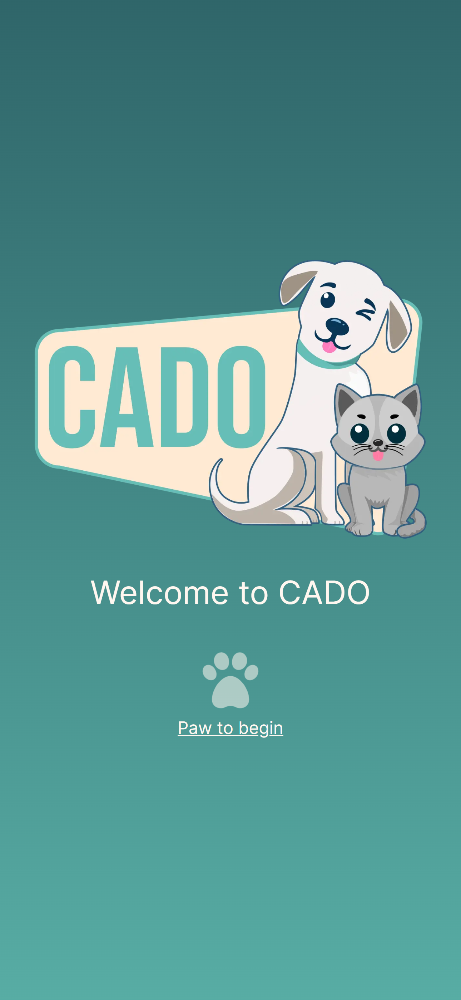
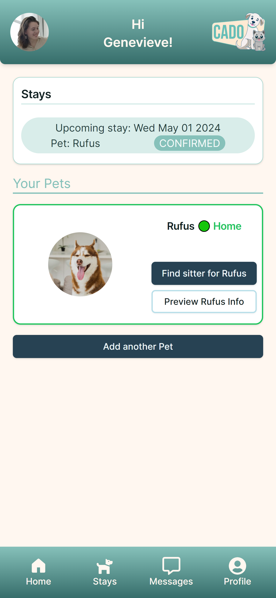
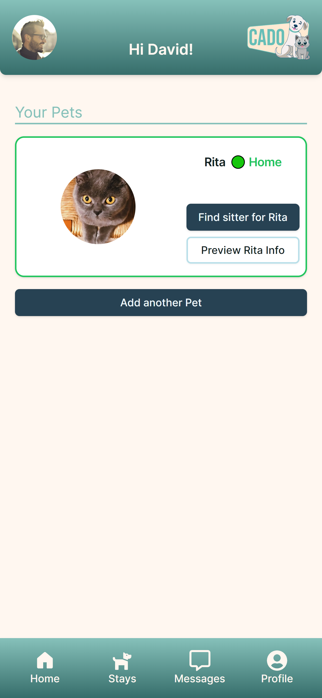
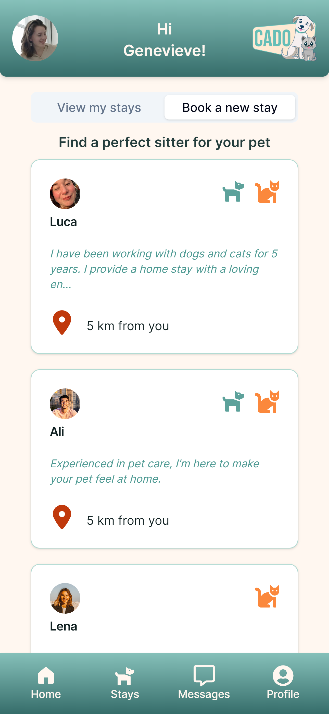
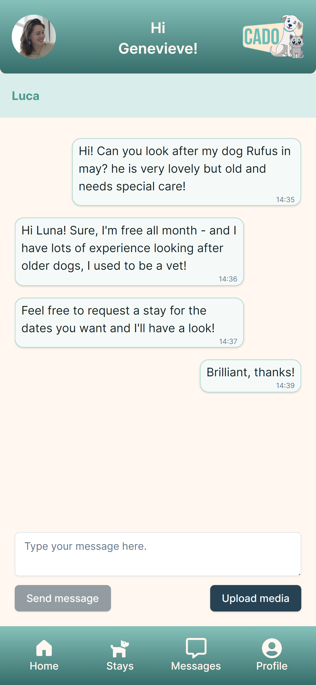
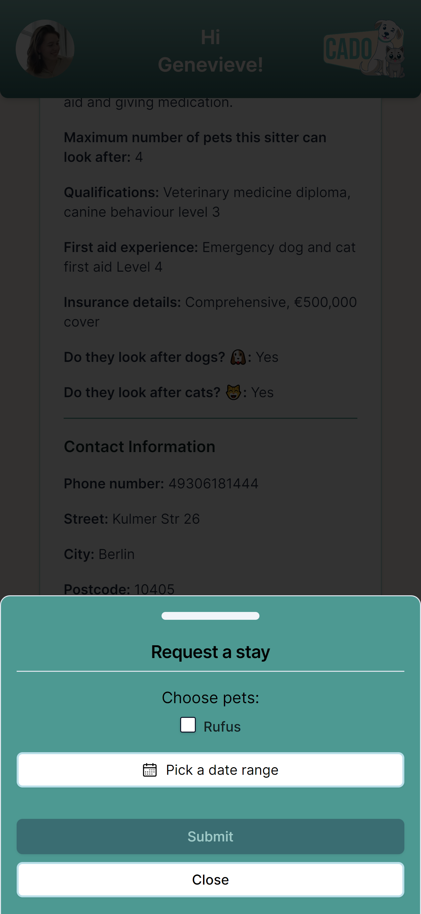
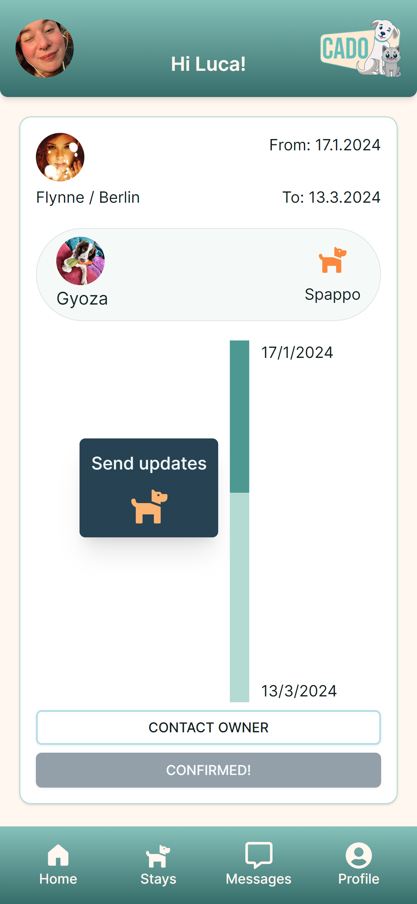
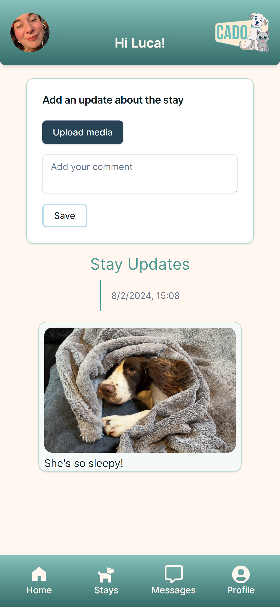

<style type="text/css" rel="stylesheet">
  h3 {
    margin: 0;
    font-size: 16px;
  }

  .avatar {
    display: flex;
    flex-direction: column;
    align-items: center;
    text-align: center;
  }

  .avatar-image {
    border-radius: 10000px;
  }

  .images-row {
    display: flex;
    justify-content: center;
    gap: 40px;
    margin: 30px 0;
  }

  .app-image {
    text-align: center;
    margin: 30px 0;
  }

  .contributors {
    display: flex;
    justify-content: center;
    width: 100%;
    gap: 20px
  }
</style>

# CADO - Connecting pet owners with loving pet sitters

Cado is an app that allows pet owners to search pet sitters nearby and helps pet sitters manage their schedule. Thanks to CADO, owners can rest assured that their pet is in good hands. Check out [this video](https://www.youtube.com/watch?v=RXkWKWYjr74) to get a good overview of how CADO works

<div class="images-row">
  
  
  
</div>

## Features of CADO

- **Pet information**: Pet owners can add all the relevant information about their pet, so pet sitters know how to best take care of their companion.

<div class="app-image">
  
</div>

- **Search by geolocation**: Pet owners can search sitters nearest to them. The app leverages on MongoDB [GeoJSON objects](https://www.mongodb.com/docs/manual/geospatial-queries/) and [Geocoding API](https://geocode.maps.co/).

<div class="app-image">
  
</div>

- **Real timechat**: Using socket.io, CADO allows owners and sitters to chat in real time. Pet owners can then request a stay

<div class="images-row">
  
  
</div>

- **Pet stay updates**: Pet owners get a timeline view showing when they'll see again their loved pet, with photo and video updates.

<div class="images-row">
  
  
</div>

## Getting started

### API and connection keys

If you want to run this app, you will need the following API keys:

- **MongoDB connection key**. You can use a cloud database provider, such as [MongoDB Atlas](https://www.mongodb.com/atlas) or run a local instance of [MongoDB Compass](https://www.mongodb.com/products/tools/compass).

- **[Clerk public and private keys](https://clerk-docs-git-prettier-fixes.clerkpreview.com/quickstarts/nextjs/stable#set-environment-keys)**

- **[Cloudinary admin keys](https://cloudinary.com/documentation/admin_api)**

- **[Geocoding API keys](https://geocode.maps.co/)**

### Installing the app

Clone this repo and `npm install`

Then, create a `.env.local` file with the following environment variables:

```
MONGODB_URI=<MongoDB connection string>
CLERK_SECRET_KEY=<Clerk secret key>
GEOCODE_KEY = <https://geocode.maps.co/ free API key>

NEXT_PUBLIC_CLERK_PUBLISHABLE_KEY=<Clerk publishable key>
NEXT_PUBLIC_CLERK_SIGN_IN_URL=/sign-in
NEXT_PUBLIC_CLERK_SIGN_UP_URL=/sign-up
NEXT_PUBLIC_CLERK_AFTER_SIGN_IN_URL=/dashboard
NEXT_PUBLIC_CLERK_AFTER_SIGN_UP_URL=/dashboard/choose-role
NEXT_PUBLIC_CLOUDINARY_CLOUD_NAME=<Cloudinay cloud name>
```

- Run the following command in the MongoDB shell of your database: `db.User.createIndex( { "contact.loc" : "2dsphere" } )` This will create the index necessary to perform for pet sitters nearby.

- In the folder `./src/lib/db/mocks` you can find the files corresponding to the different collections the CADO database is made from. Simply import them into a fresh database in your MongoDB Atlas or Compass.

### Running the app

Open a new terminal and run `npm run socket`. This will start the socket.io server for handling real time messages

Open another terminal and run `npm run dev`, which will start the NextJS application, running by default on http://localhost:3000

If a browser window doesn't open, just open a new one and type this address. You should see:


Click on 'Paw to begin', create a new user with Clerk, choose a role (owner or sitter) and you're good to start exploring CADO.

## Tech stack

CADO is has been written fully in Typescipt, and is powered by the following technologies:

- ### Frontend

  - React with [NextJS client components](https://nextjs.org/docs/app/building-your-application/rendering/client-components), using [NextJS app router](https://nextjs.org/docs/app)

  - [Tailwind CSS](https://tailwindcss.com/)

  - [shadcn/ui](https://ui.shadcn.com/) for standard components

  - [React Icons](https://react-icons.github.io/react-icons/)

- ### Backend

  - [NextJS server components](https://nextjs.org/docs/app/building-your-application/rendering/server-components)

  - [MongoDB](https://www.mongodb.com/) with [Mongoose](https://mongoosejs.com/) as ORM

  - [Clerk](https://clerk.com/) for authentication

  - [Cloudinary](https://cloudinary.com/) to manage image and video upload and storage

  - [Socket.io](https://socket.io/) for realtime chat with websockets

  - [Jest](https://jestjs.io/) for testing

- ### Design

  - [Excalidraw](https://excalidraw.com/) for sharing ideas and concepts

  - [Figma](https://www.figma.com/) for detailed branding and wireframing

  - Adobe Photoshop

## Contributors

<div class="contributors">
  <div class="avatar">
    <a href="https://github.com/ootwither">
      
    </a>
    <h3>Dougal Wallace</h3>
  </div>
  <div class="avatar">
    <a href="https://github.com/estdavid">
      
    </a>
    <h3>David de Esteban</h3>
  </div>
  <div class="avatar">
    <a href="https://github.com/diankita">
      
    </a>
    <h3>Diana Sulkova</h3>
  </div>
  <div class="avatar">
    <a href="https://github.com/alaa-cw">
      
    </a>
    <h3>Mohammad Ala Tahhan</h3>
  </div>
  <div class="avatar">
    <a href="https://github.com/goran853">
      
    </a>
    <h3>Goran Levanic</h3>
  </div>
</div>
