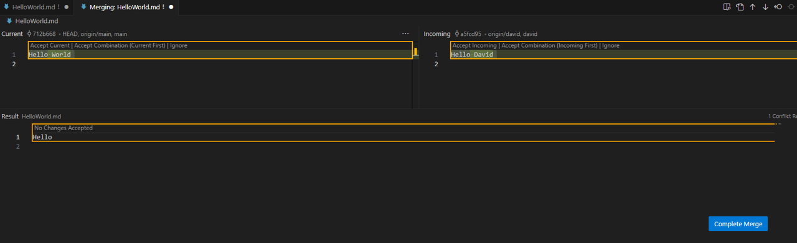
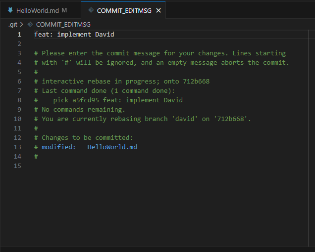

# Github guide

This guide gives a general overview of the main Github worflows

## Working on a new feature

When starting to work on a new feature the process will follow these main steps:
Step | Git command
--- | ---
Make sure we don't have any modified files. Commit them or undo changes | `git add` + `git commit` or `git restore .`
Get the latest version of the main branch to our local directory | `git switch main` + `git pull`
Create a new branch with the name of the feature | `git switch -c <new-feature>`
Create/modify the files that we need for the feature |
Make commits to the new branch as needed | `git add` + `git commit`
Once the feature is ready, or if it takes a long time, it's good practice to merge the latest status of the main branch into our feature branch | [Steps to merge main into our feature](#steps-to-merge-main-into-our-feature)
Resolve any potential merge conflicts | See 'resolving merge conflicts'
Push the feature to Github repo | `git push origin <new-feature>`
On Github create and merge pull request | See 'creating and merging a pull request'

## Merging latest version of main into our feature branch

We will be using the rebase approach, which updates the main branch with the latest changes and then adds our code after that latest update.
The following two images ecxplain how rebase works. We start our feature when `main` is on commit `C2`. Meanwhile, commit `C3` is added to main.
When we merge with rebase, our feature is added after the latest commit (`C3`) instead of trying to create a mixture of `C3` + `C4`

Branches diverging:


Pulling latest version of main with rebase:


### Steps to merge main into our feature

| Step                                                          | Git command                |
| ------------------------------------------------------------- | -------------------------- |
| Make sure that all of the changes in our feature are commited | `git add` + `git commit`   |
| Switch to main                                                | `git switch main`          |
| Pull the latest version of main from the remote repo          | `git pull`                 |
| Switch back to our branch                                     | `git switch <new-feature>` |
| Merge main into our branch with rebase                        | `git rebase main`          |

## Resolving merge conflicts

Merge conflicts happen when we work on a file from main which is changed by another team member while we were changing it ourselves.

`Breathe deeply, focus on one item at a time`

The best way to solve merge conflicts is to make sure that we are all working on different files. Still, they can happen and will happen, so it's good to know what to do.

This is a sample of how a merge conflict can occur. We are ready to ship our feature, so we switch to `main`, pull the latest updates, switch back to our feature branch, type `git rebase main` and this happens:

```
$ git rebase main
Auto-merging HelloWorld.md
CONFLICT (content): Merge conflict in HelloWorld.md
error: could not apply a5fcd95... feat: implement David
hint: Resolve all conflicts manually, mark them as resolved with
hint: "git add/rm <conflicted_files>", then run "git rebase --continue".
hint: You can instead skip this commit: run "git rebase --skip".
hint: To abort and get back to the state before "git rebase", run "git rebase --abort".
```

The files(s) with conflicts will be highlighted by VS Code, so we need to select them one by one and click on `Resolve in Merge Editor`


Once inside the merge editor, we will get two windows on top and one in the bottom:

- The window on the left shoes the _Current_ changes, which represent the status of branch `main`.
- The window on the right shows the _Incoming_ changes, which represent the changes we creates in our feature
- The window in the bottom shows the _Result_, which is what will be committed once we click on `Complete Merge`



The _merge editor_ gives us the options to accept the current or the incoming, or both. In any case, it's always good to check what the final result becomes before clicking on `Complete Merge`

Once we have gone through all the conflicts, we need to commit them:

| Step                                                                                     | Git command             |
| ---------------------------------------------------------------------------------------- | ----------------------- |
| Add all the files that were changed in the feature branch during the conflict resolution | `git add`               |
| Commit the rebase merge                                                                  | `git rebase --continue` |

A file with the name COMMIT_EDITMSG pops up in VS Code. We edit the message if needed and close it



And that's it! We can continue with the [usual workflow](#working-on-a-new-feature) by pushing the feature to the remote repo and creating a pull request.
